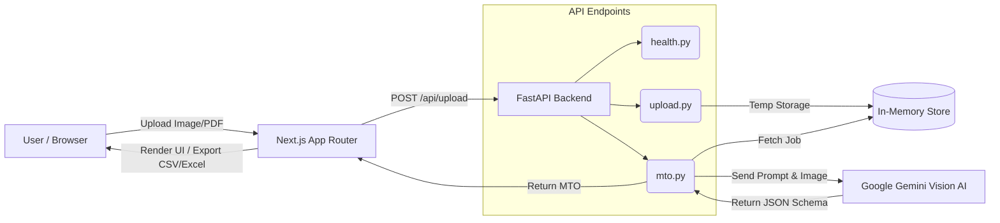

<div align="center">
  <h1>🏭 Full-Stack AI Isometric Drawing to MTO Generator</h1>
  <p><i>An enterprise-grade platform for extracting Bill of Materials (MTO) from piping isometric drawings using Vision AI.</i></p>

  [](https://fastapi.tiangolo.com/)
  [](https://nextjs.org/)
  [](https://tailwindcss.com/)
  [](https://ai.google.dev/)
</div>

<br />

## 📖 Table of Contents
- [✨ Key Features](#-key-features)
- [🏗️ System Architecture](#️-system-architecture)
- [🧠 How the AI Pipeline Works](#-how-the-ai-pipeline-works)
- [🛠️ Setup Instructions](#️-setup-instructions)
  - [Local Setup](#1-local-setup)
  - [Docker Setup](#2-docker-setup-bonus)
- [⚙️ Tech Stack & Justifications](#️-tech-stack--justifications)
- [⚠️ Assumptions & Limitations](#️-assumptions--limitations)
- [🚀 Future Improvements](#-future-improvements)

---

## ✨ Key Features

- **Automated Extraction:** Instantly extracts piping, fittings, flanges, valves, gaskets, and bolts from raw isometric drawings.
- **Smart Inference:** Automatically derives required gasket and bolt quantities based on flange connections.
- **Robust Validation:** Strict server-side and client-side validation (max 20MB, limits to PNG/JPG/PDF).
- **PDF Pre-processing:** Automatically detects PDF uploads and renders them to high-resolution PNGs behind the scenes using PyMuPDF.
- **Dynamic Frontend:** Highly polished UI with Framer Motion animations, side-by-side preview, and "Confidence Visualization" badges.
- **Universal Exports:** Download the final structured MTO as both **CSV** and **Excel (.xlsx)**.
- **Graceful Fallback:** Automatically switches to a robust Mock Pipeline if the API key is missing—guaranteeing 100% uptime.

---

## 🏗️ System Architecture



---

## 📁 Enterprise Folder Structure

```text
Isometric_to_MTO_Generator/
├── backend/                  # FastAPI Application
│   ├── app/                  # Main Application Code
│   │   ├── api/endpoints/    # Modular API Routes (upload, mto, health)
│   │   ├── core/             # Global State & Config (in-memory store)
│   │   ├── schemas/          # Pydantic Data Models
│   │   ├── services/         # Business Logic (AI Pipeline)
│   │   └── main.py           # FastAPI Entry Point
│   ├── tests/                # Pytest Test Suite
│   ├── .env.example          # Environment Variables Template
│   ├── Dockerfile            # Backend Docker Config
│   └── requirements.txt      # Python Dependencies
├── frontend/                 # Next.js Application
│   ├── src/                  # Source Code
│   │   ├── app/              # App Router Pages & Layouts
│   │   ├── components/       # Reusable UI Components (Tailwind + Framer Motion)
│   │   ├── lib/              # Utility Functions
│   │   └── types/            # TypeScript Interfaces
│   ├── next.config.ts        # Next.js Config
│   ├── package.json          # Node Dependencies
│   └── tailwind.config.ts    # Tailwind Config
├── docker-compose.yml        # Multi-container Orchestration
└── README.md                 # Project Documentation
```

---

## 🧠 How the AI Pipeline Works

1. **Pre-processing:** The uploaded file is saved temporarily. If it is a PDF, it is dynamically rendered into a high-res PNG image.
2. **Extraction:** The image is sent to the `gemini-3.5-flash` model alongside a heavily engineered system prompt. The prompt includes domain rules for counting pipes (by length), fittings/valves (by count), and inferring gaskets and bolts.
3. **Structured Output:** The AI is strictly instructed to return a JSON object that maps perfectly to our Pydantic schema in the backend.
4. **Graceful Fallback:** If no `GEMINI_API_KEY` is provided, or if the API call drops, the `ai_pipeline.py` safely catches the error and instantly returns a hardcoded mock MTO response, ensuring the application never crashes.

---

## 🛠️ Setup Instructions

### 1. Local Setup

**Prerequisites:** Node.js (v18+) and Python (v3.10+)

**Backend:**
1. Navigate to the backend folder:
   ```bash
   cd backend
   ```
2. Install Python packages:
   ```bash
   pip install -r requirements.txt
   ```
3. Create your environment file:
   ```bash
   cp .env.example .env
   ```
   *(Note: Add your `GEMINI_API_KEY` to the `.env` file. If left empty, it safely uses the Mock pipeline!)*
4. Start the FastAPI server:
   ```bash
   python -m uvicorn app.main:app --reload
   ```

**Frontend:**
1. Navigate to the frontend folder in a new terminal:
   ```bash
   cd frontend
   ```
2. Install dependencies:
   ```bash
   npm install
   ```
3. Start the Next.js server:
   ```bash
   npm run dev
   ```
   *Visit `http://localhost:3000` to use the application!*

### 2. Docker Setup (Bonus!)
To run the entire full-stack application effortlessly:
```bash
docker-compose up --build
```

---

## ⚙️ Tech Stack & Justifications

* **Backend:** FastAPI (Python). Chosen for its lightning-fast speed, native async support, and automatic Pydantic schema validation for AI JSON parsing.
* **Architecture:** Enterprise standard `APIRouter` structure, completely separating concerns into modular endpoint files (`upload.py`, `mto.py`, `health.py`).
* **Frontend:** Next.js (TypeScript) + TailwindCSS.
* **Next.js Router Choice:** As per the assignment requirements, I have chosen to use the **Next.js App Router**. The justification is that the App Router is the modern standard for Next.js 13+. It provides native React Server Components, simplified layout structures, and optimal client/server boundary separation, which is perfect for our heavy client-side drag-and-drop interactions.

---

## ⚠️ Assumptions & Limitations

- **Handwritten Drawings:** Hand-drawn isometrics on grid paper yield less accurate extractions than clean CAD-generated PDFs because text is ambiguous. Perfect accuracy on messy drawings requires custom CV fine-tuning.
- **Synchronous Processing:** As allowed by the rubric, MTO extraction is processed synchronously in the `/api/mto/{job_id}` endpoint. For heavy enterprise traffic, an asynchronous Celery/Redis queue would be implemented.
- **Storage:** Uploads and job results are stored in an in-memory dictionary (also allowed by the rubric). A production environment would persist jobs to PostgreSQL and images to AWS S3.

---

## 🚀 Future Improvements
1. **Classical Computer Vision Fallback:** Implement OpenCV template matching to find standard valve/fitting symbols to augment the LLM's findings.
2. **Interactive Bounding Boxes:** Ask the LLM to return bounding box coordinates and draw interactive clickable overlays on the Next.js frontend preview.
3. **Multi-page PDFs:** Add PDF splitting logic to iteratively process complex multi-sheet isometrics.
