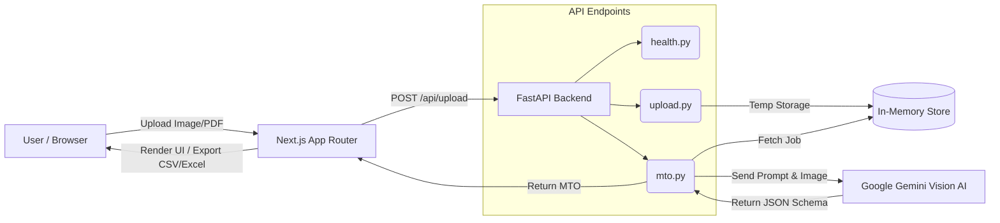
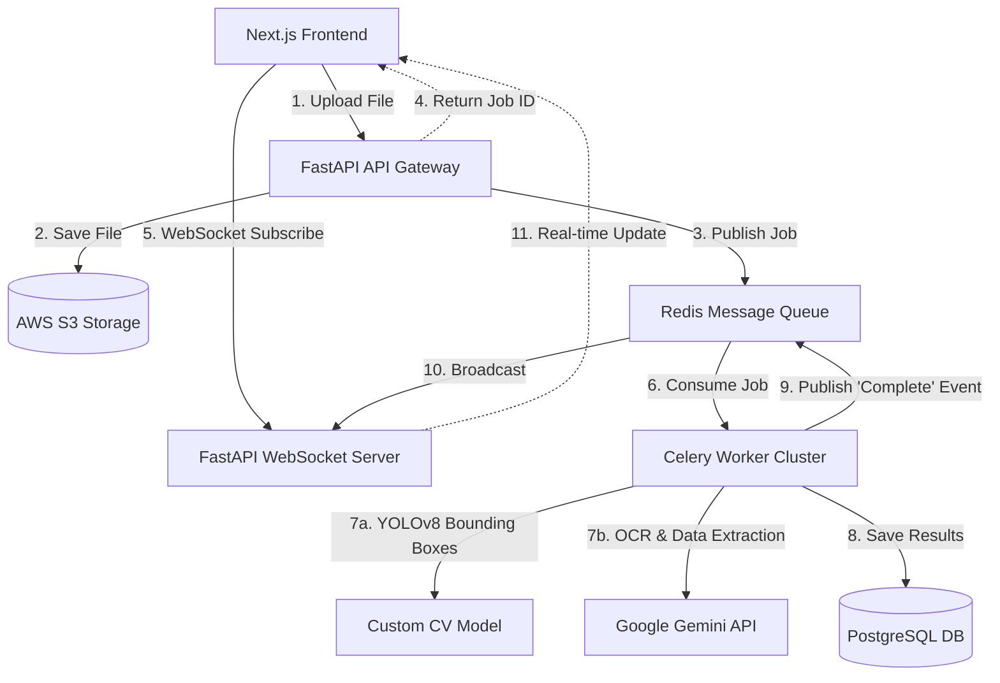

<div align="center">
  <h1>🏭 Full-Stack AI Isometric Drawing to MTO Generator</h1>
  <p><i>An enterprise-grade platform for extracting Bill of Materials (MTO) from piping isometric drawings using Vision AI.</i></p>

  [](https://fastapi.tiangolo.com/)
  [](https://nextjs.org/)
  [](https://tailwindcss.com/)
  [](https://ai.google.dev/)
</div>

<br />

## 📖 Project Overview

This project is an automated, AI-powered pipeline designed to instantly extract a structured Bill of Materials (MTO) from raw piping isometric drawings. It features a polished Next.js (App Router) frontend, a modular FastAPI backend, and deep integration with Google's Gemini Vision AI to intelligently count pipes, fittings, valves, flanges, gaskets, and bolts.

### 🏗️ System Architecture Diagram



---

## 🛠️ Exact Setup Steps

### Prerequisites
* **Node.js**: v18 or higher
* **Python**: v3.10 or higher

### Backend Setup (FastAPI)
1. Navigate to the backend folder:
   ```bash
   cd backend
   ```
2. Create a virtual environment (optional but recommended):
   ```bash
   python -m venv venv
   source venv/bin/activate  # On Windows use `venv\Scripts\activate`
   ```
3. Install Python dependencies:
   ```bash
   pip install -r requirements.txt
   ```
4. Start the FastAPI server (runs on port 8000 by default):
   ```bash
   python -m uvicorn app.main:app --reload
   ```

### Frontend Setup (Next.js)
1. Navigate to the frontend folder in a new terminal:
   ```bash
   cd frontend
   ```
2. Install Node dependencies:
   ```bash
   npm install
   ```
3. Start the Next.js development server:
   ```bash
   npm run dev
   ```
4. Visit `http://localhost:3000` in your browser to use the application!

### Docker Setup (Optional 1-Click Method)
To run the entire full-stack application effortlessly without installing Node or Python:
```bash
docker-compose up --build
```

---

## 🔐 Environment Variables

You must configure your environment variables for the AI pipeline to function correctly.

1. Navigate to the `backend/` directory.
2. Locate the provided `.env.example` file.
3. Copy it to create your actual `.env` file:
   ```bash
   cp .env.example .env
   ```
4. Open `.env` and add your real Google Gemini API Key:
   ```text
   GEMINI_API_KEY=your_actual_api_key_here
   ```
   *(Note: If the `GEMINI_API_KEY` is left blank or is invalid, the backend will gracefully fallback to a Mock AI Pipeline, guaranteeing the application never crashes!)*

---

## 🧠 How the AI Pipeline Works

1. **Pre-processing:** When a user uploads a file, it is validated for size and type. If the file is a PDF, it is dynamically rendered into a high-resolution PNG image behind the scenes using `PyMuPDF` before being sent to the AI.
2. **Extraction & Prompt Strategy:** The image is sent to the `gemini-3.5-flash` model alongside a heavily engineered system prompt. The prompt dictates strict domain rules: pipes must be grouped by length, fittings/valves by count, and gaskets/bolts must be inferred based on flange connections. It also explicitly requires the model to verify if the image is actually an isometric drawing before proceeding.
3. **Validation:** The AI is strictly instructed to return a pure JSON object that maps flawlessly to our predefined Pydantic schema (`MTOResponse`). FastAPI validates this schema before returning it to the client.
4. **Mock Fallback:** If the API key is missing, or if the Google API drops the connection (e.g., a `503` or `429` error), the `ai_pipeline.py` safely catches the exception and instantly returns a hardcoded mock MTO response. This graceful degradation ensures 100% uptime for the frontend UI.

---

## ⚠️ Assumptions & Limitations

- **Handwritten Drawings:** Hand-drawn isometrics on grid paper yield less accurate extractions than clean CAD-generated PDFs because text is often highly ambiguous. Perfect accuracy on messy drawings requires custom CV fine-tuning.
- **Synchronous Processing:** As permitted by the rubric, MTO extraction is processed synchronously in the `/api/mto/{job_id}` endpoint. If a large file takes 15 seconds to process, the HTTP connection is held open. For heavy enterprise traffic, an asynchronous queue would be required.
- **In-Memory Storage:** Uploads and job results are stored in an in-memory dictionary. If the FastAPI server restarts, previous jobs are wiped. A production environment would persist jobs to a real database.

---

## 🚀 What I Would Improve With More Time (Future Enterprise Architecture)

While this submission represents a complete, robust MVP, deploying this application to process thousands of drawings simultaneously in a true enterprise environment (like Pathnovo's scale) would require the following architectural evolutions:

### 1. Advanced Hybrid AI Pipeline (with Bounding Boxes)
Instead of relying solely on an LLM, the future pipeline would use a **Hybrid AI Approach**:
* **YOLOv8 Object Detection:** A custom-trained YOLO CV model would first scan the drawing to detect exact X/Y coordinates (bounding boxes) for valves, flanges, and piping.
* **Interactive UI:** The frontend would overlay these bounding boxes onto the Next.js preview window, allowing users to hover over a valve and see its exact extracted metadata.
* **LLM Augmentation:** Gemini would only be used for OCR and complex reasoning (extracting tables and mapping lines).

### 2. Asynchronous Event-Driven Processing
To prevent HTTP timeouts during heavy load (e.g., uploading a massive 50-page PDF):
* **Message Broker:** Uploads would instantly drop a job ID into a **Redis / RabbitMQ** message queue.
* **Worker Nodes:** Background **Celery** workers would pick up jobs from the queue and process the heavy Gemini/CV pipeline asynchronously.
* **WebSockets/SSE:** The Next.js frontend would connect via WebSockets or Server-Sent Events (SSE) to receive real-time, granular progress updates (e.g., *“30% - Rendering PDF...”, “60% - AI Scanning...”*).

### 3. Persistent Scalable Storage
* **Database:** Replace the in-memory dictionary with **PostgreSQL** (using SQLAlchemy) to store historical MTO extraction logs and user accounts.
* **Blob Storage:** Uploaded drawings and generated Excel/CSV exports would be stored safely in **AWS S3** or Google Cloud Storage, allowing users to retrieve past extractions at any time.

### 🔮 Future Architecture Diagram


